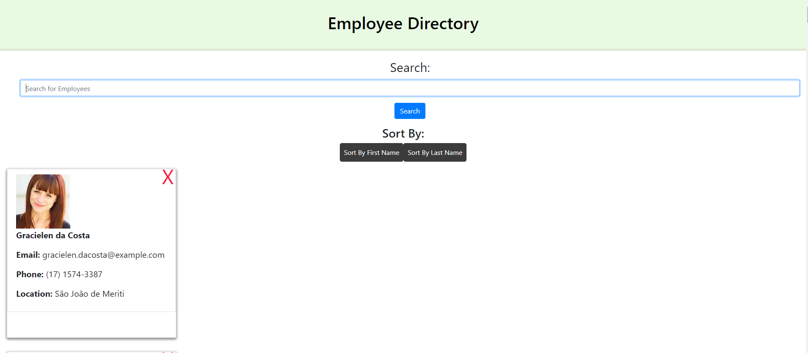

# Employee Directory

# Description 
As a user, I want to be able to view my entire employee directory at once so that I have quick access to their information. The user is able to sort the list of the employees by first and last name. Not only that, the user can search the user by the first letter of the first name.

# Table Of Contents

## [Description](#description)

## [Screenshot](#screenshot)

## [Deployment](#deployment)

## [Tech Used](#tech)

# Screenshot 

# Deployment 
https://swoo328.github.io/EmployeeDirectory/
https://github.com/swoo328/EmployeeDirectory

# Tech Used 
1. React.js
2. Node.js
3. Axios
4. Random User Generator API
